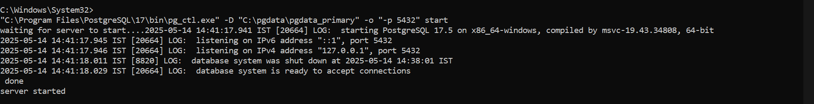
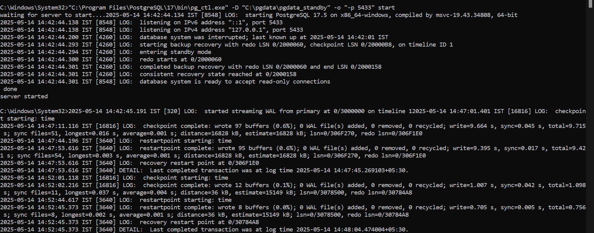
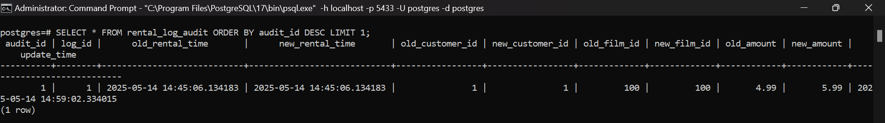

# PostgreSQL Replication & Audit Logging Setup

### Goal

The goal of the process is to set up a **replication system** where changes made to the `rental_log` table on the **primary PostgreSQL server** are replicated to the **standby server**, and to **track updates** to the `rental_log` table using an **audit mechanism**, which logs changes into a `rental_log_audit` table.

---

###  STEP 1: Connect to Primary (Port 5432)

**Create `rental_log` Table:**

```sql
CREATE TABLE rental_log (
    log_id SERIAL PRIMARY KEY,
    rental_time TIMESTAMP,
    customer_id INT,
    film_id INT,
    amount NUMERIC,
    logged_on TIMESTAMP DEFAULT CURRENT_TIMESTAMP
);
```

**Insert Sample Data:**

```sql
INSERT INTO rental_log (rental_time, customer_id, film_id, amount)
VALUES (CURRENT_TIMESTAMP, 1, 100, 4.99);
```

---

###  STEP 2: Connect to Standby Server (Port 5433)

**Connect Command:**

```bash
"C:\Program Files\PostgreSQL\17\bin\psql.exe" -h localhost -p 5433 -U postgres -d postgres
```

**Check Replication on Standby:**

```sql
SELECT * FROM rental_log ORDER BY log_id DESC LIMIT 1;
```

---

###  STEP 3: Create Stored Procedure on Primary

**Stored Procedure to Insert Rental Log:**

```sql
CREATE OR REPLACE PROCEDURE sp_add_rental_log(
    p_customer_id INT,
    p_film_id INT,
    p_amount NUMERIC
)
LANGUAGE plpgsql
AS $$
BEGIN
    -- Insert data into the rental_log table
    INSERT INTO rental_log (rental_time, customer_id, film_id, amount)
    VALUES (CURRENT_TIMESTAMP, p_customer_id, p_film_id, p_amount);

EXCEPTION WHEN OTHERS THEN
    -- Handle any errors
    RAISE NOTICE 'Error occurred: %', SQLERRM;
END;
$$;
```

**Call the Procedure:**

```sql
CALL sp_add_rental_log(1, 100, 4.99);
```

---

###  STEP 4: Verify Replication on Standby

```sql
SELECT * FROM rental_log ORDER BY log_id DESC LIMIT 1;
```

---

###  STEP 5: Create Audit Logging

**Create `rental_log_audit` Table:**

```sql
CREATE TABLE rental_log_audit (
    audit_id SERIAL PRIMARY KEY,
    log_id INT,
    old_rental_time TIMESTAMP,
    new_rental_time TIMESTAMP,
    old_customer_id INT,
    new_customer_id INT,
    old_film_id INT,
    new_film_id INT,
    old_amount NUMERIC,
    new_amount NUMERIC,
    update_time TIMESTAMP DEFAULT CURRENT_TIMESTAMP
);
```

**Create Trigger Function:**

```sql
CREATE OR REPLACE FUNCTION log_rental_log_update()
RETURNS TRIGGER AS $$
BEGIN
    INSERT INTO rental_log_audit (
        log_id,
        old_rental_time,
        new_rental_time,
        old_customer_id,
        new_customer_id,
        old_film_id,
        new_film_id,
        old_amount,
        new_amount
    )
    VALUES (
        OLD.log_id,
        OLD.rental_time,
        NEW.rental_time,
        OLD.customer_id,
        NEW.customer_id,
        OLD.film_id,
        NEW.film_id,
        OLD.amount,
        NEW.amount
    );
    RETURN NEW;
END;
$$ LANGUAGE plpgsql;
```

**Create Trigger:**

```sql
CREATE TRIGGER rental_log_update_trigger
AFTER UPDATE ON rental_log
FOR EACH ROW
EXECUTE FUNCTION log_rental_log_update();
```

---

###  STEP 6: Test the Trigger

**Update a Record on Primary:**

```sql
UPDATE rental_log
SET amount = 5.99
WHERE log_id = 1;
```

**Verify on Standby (Audit Table):**

```sql
SELECT * FROM rental_log_audit ORDER BY audit_id DESC;
```



---


